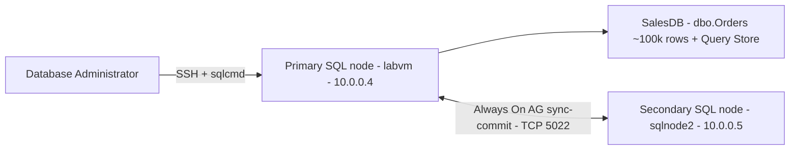
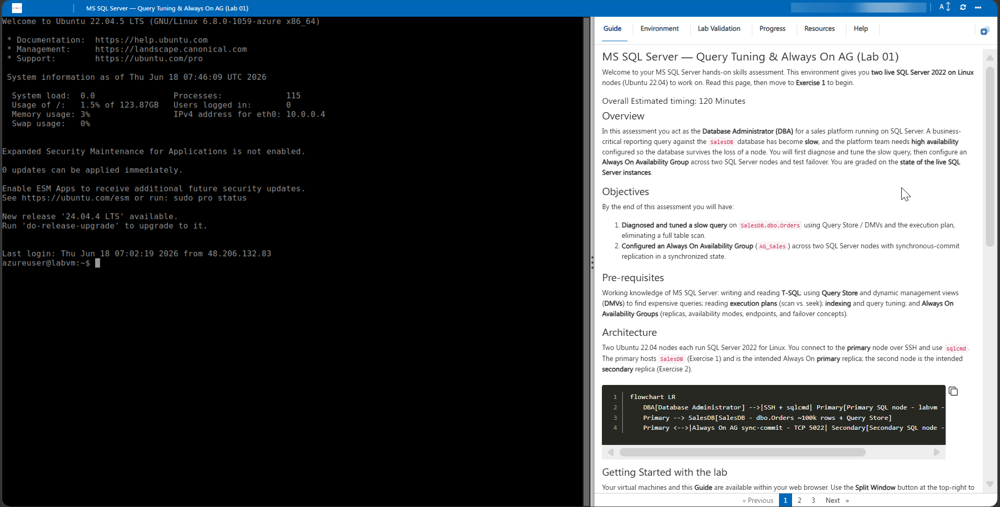
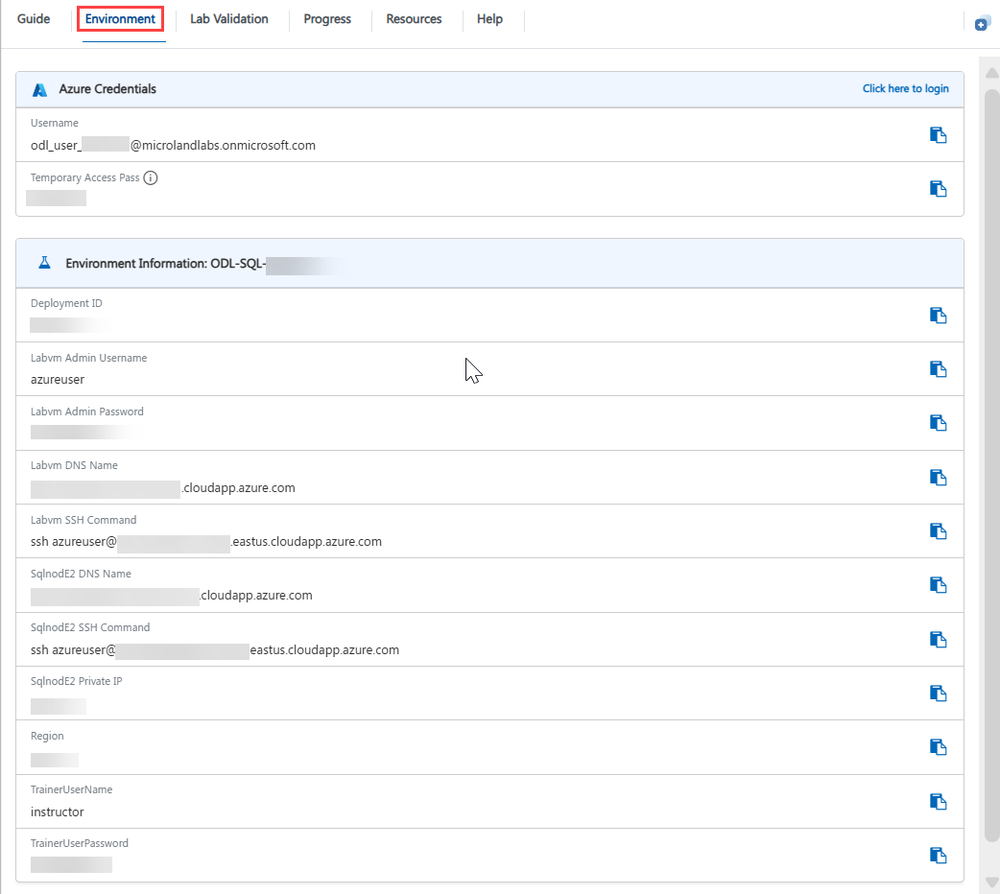
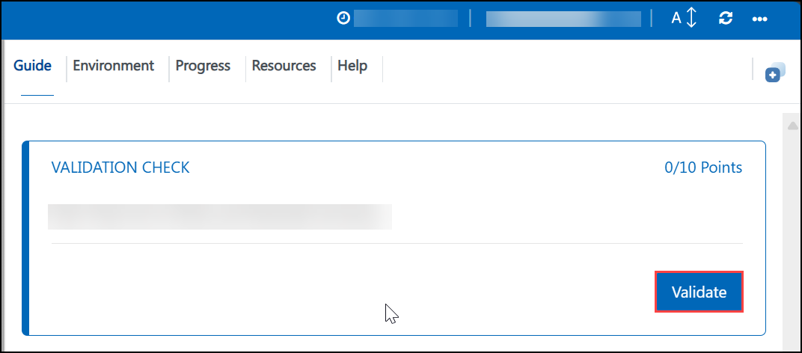

# **MS SQL Server — Query Tuning & Always On AG (Lab 01)**

Welcome to your MS SQL Server hands-on skills assessment. This environment gives you **two live SQL Server 2022 on Linux** nodes (Ubuntu 22.04) to work on. Read this page, then move to **Exercise 1** to begin.

### Overall Estimated timing: 120 Minutes

## Overview

In this assessment you act as the **Database Administrator (DBA)** for a sales platform running on SQL Server. A business-critical reporting query against the `SalesDB` database has become **slow**, and the platform team needs **high availability** configured so the database survives the loss of a node. You will first diagnose and tune the slow query, then configure an **Always On Availability Group** across two SQL Server nodes and test failover. You are graded on the **state of the live SQL Server instances**.

## Objectives

By the end of this assessment you will have:

1. **Diagnosed and tuned a slow query** on `SalesDB.dbo.Orders` using Query Store / DMVs and the execution plan, eliminating a full table scan.
2. **Configured an Always On Availability Group** (`AG_Sales`) across two SQL Server nodes with synchronous-commit replication in a synchronized state.

## Pre-requisites

Working knowledge of MS SQL Server: writing and reading **T-SQL**; using **Query Store** and dynamic management views (**DMVs**) to find expensive queries; reading **execution plans** (scan vs. seek); **indexing** and query tuning; and **Always On Availability Groups** (replicas, availability modes, endpoints, and failover concepts).

## Architecture

Two Ubuntu 22.04 nodes each run SQL Server 2022 for Linux. You connect to the **primary** node over SSH and use `sqlcmd`. The primary hosts `SalesDB` (Exercise 1) and is the intended Always On **primary** replica; the second node is the intended **secondary** replica (Exercise 2).

## Getting Started with the lab

Your virtual machines and this **Guide** are available within your web browser. Use the **Split Window** button at the top-right to open the guide beside your terminal.

## Accessing Your Lab Environment

1. Connect to the **primary** SQL node over SSH using the details on the **Environment** tab.

    - **SSH command:** see the **LABVM SSH Command** output on the **Environment** tab
    - **Username:** see the **LABVM Admin Username** output on the **Environment** tab
    - **Password:** see the **LABVM Admin Password** output on the **Environment** tab

1. The **second** SQL node (`sqlnode2`, private IP `10.0.0.5`) is reachable over SSH using the **SQLNODE2 SSH Command** output on the **Environment** tab, and over the VNet from the primary.

1. Connect to SQL Server with `sqlcmd` using the **SA** login. The sample password is **`NedSQL@1234!`** (also recorded in `/home/labuser/README.txt`):

    - `/opt/mssql-tools/bin/sqlcmd -S localhost -U SA -P 'NedSQL@1234!'`
    - or `/opt/mssql-tools18/bin/sqlcmd -C -S localhost -U SA -P 'NedSQL@1234!'` (the `-C` trusts the self-signed server certificate)

1. If you need the Azure portal at any point, sign in with the credentials below:

    - **Email/Username:** <inject key="AzureAdUserEmail"></inject>

    - **Password:** <inject key="AzureAdUserPassword"></inject>

1. Your environment id for this run is **<inject key="DeploymentID" enableCopy="false"/>** — quote it if you contact support.

### Environment Details

- **Two Ubuntu 22.04 SQL Server 2022 on Linux nodes** (`Standard_D2s_v3`): the primary (`labvm-<DeploymentID>`, `10.0.0.4`) and the secondary (`sqlnode2`, `10.0.0.5`).
- On the **primary**, the **`SalesDB`** database contains **`dbo.Orders`** (~100,000 rows) whose `CustomerId` column is **not indexed**, and **Query Store is enabled** so you can locate the slow query.
- Both nodes have SQL Server installed with the Always On **`hadr`** feature **enabled**, ready for you to create the `AG_Sales` Availability Group.

## Track Your Progress

Use the **Validate** button on each task to check your work. The **Progress** tab shows your validation score; it reaches 100% when all task validations pass.

## Lab Duration Extension

You have **120 minutes** for this assessment. If you need more time, click the **Hourglass** icon in the top-right of the lab environment (it appears when 10 minutes remain) and click **OK**.

## Support Contact

The CloudLabs support team is available 24/7 via email and live chat.

- Email Support: cloudlabs-support@spektrasystems.com
- Live Chat Support: https://cloudlabs.ai/labs-support

Click **Next** to begin Exercise 1.

## Happy Assessing !!
