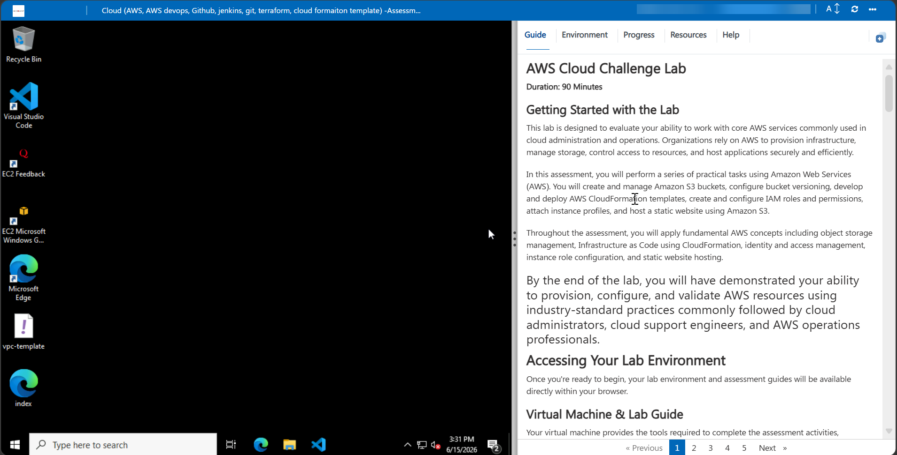
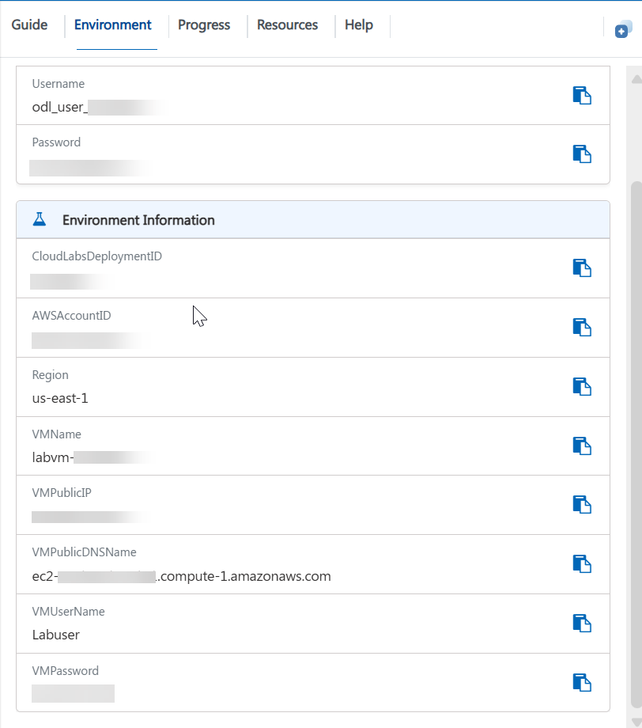
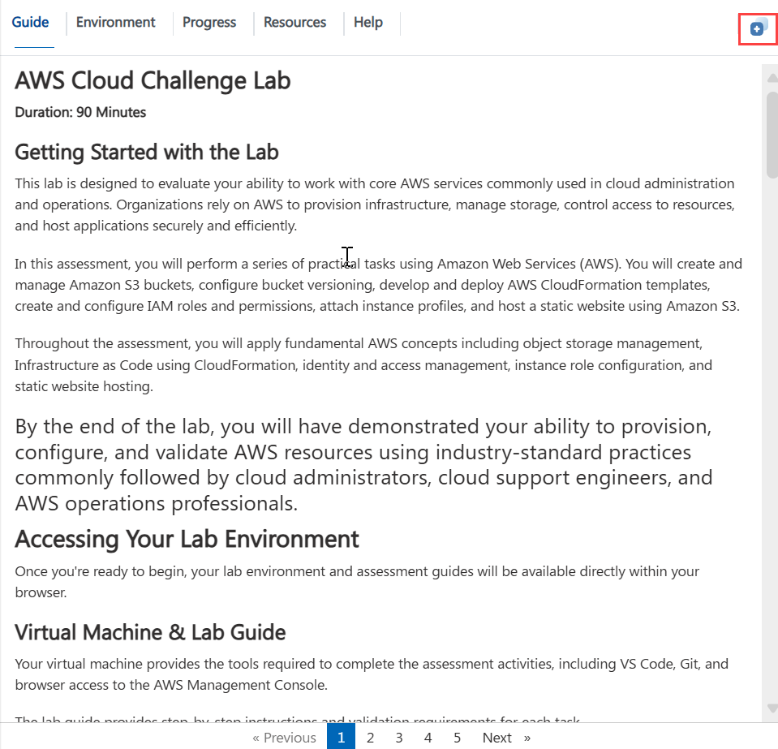
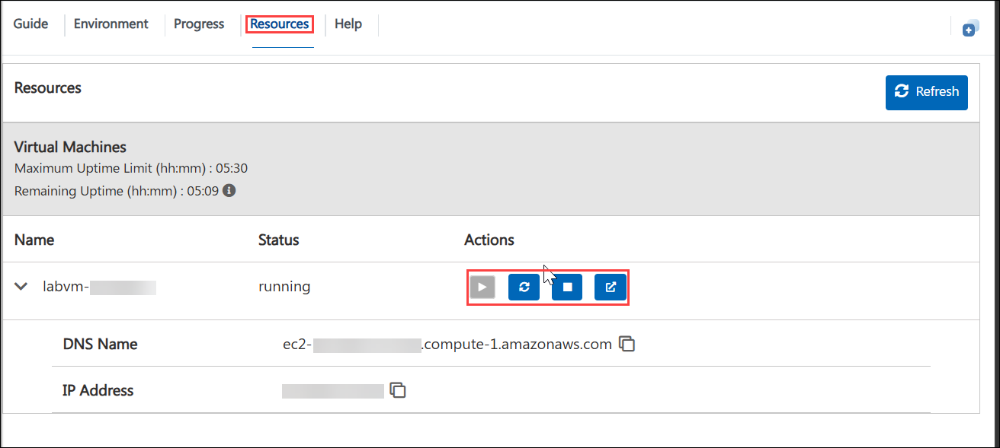
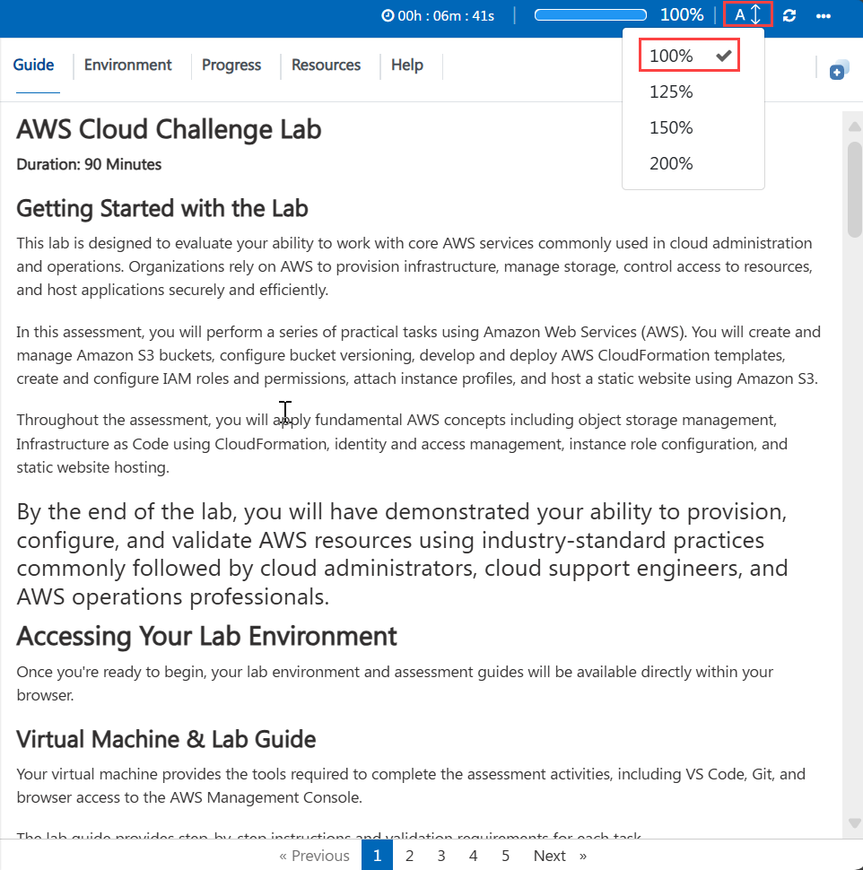

# **AWS Cloud Challenge Lab** 
**Duration: 90 Minutes**

## **Getting Started with the Lab**

This lab is designed to evaluate your ability to work with core AWS services commonly used in cloud administration and operations. Organizations rely on AWS to provision infrastructure, manage storage, control access to resources, and host applications securely and efficiently.

In this assessment, you will perform a series of practical tasks using Amazon Web Services (AWS). You will create and manage Amazon S3 buckets, configure bucket versioning, develop and deploy AWS CloudFormation templates, create and configure IAM roles and permissions, attach instance profiles, and host a static website using Amazon S3.

Throughout the assessment, you will apply fundamental AWS concepts including object storage management, Infrastructure as Code using CloudFormation, identity and access management, instance role configuration, and static website hostingBy the end of the lab, you will have demonstrated your ability to provision, configure, and validate AWS resources using industry-standard practices commonly followed by cloud administrators, cloud support engineers, and AWS operations professionals.


---

# **Accessing Your Lab Environment**

Once you're ready to begin, your lab environment and assessment guides will be available directly within your browser.

## **Virtual Machine & Lab Guide**

Your virtual machine provides the tools required to complete the assessment activities, including VS Code, Git, and browser access to the AWS Management Console.

The lab guide provides step-by-step instructions and validation requirements for each task.



---

# **Exploring Your Lab Resources**

To view environment information, credentials, and resource details, navigate to the **Environment** tab.

You can find:

* AWS Console URL
* AWS Username
* AWS Password
* Deployment Information
* Resource Details



---

# **Utilizing the Split Window Feature**

For convenience, you can open the lab guide in a separate window by selecting the **Split Window** button from the top-right corner.

This allows you to follow instructions while working in the AWS Console simultaneously.



---


### **AWS Region**

```text
us-east-1
```

---

# **Using the Virtual Machine**

The provided virtual machine contains the tools required for the assessment.

Installed tools include:

* Visual Studio Code (VS Code)
* Git
* Web Browser

You may use VS Code to create CloudFormation templates and website files during the assessment.

---

# **Managing Your Virtual Machine**

You may Start, Restart, or Stop your virtual machine at any time using the **Resources** tab available within the lab environment.



---

# **Lab Guide Zoom In / Zoom Out**

To adjust the zoom level of the lab environment page, use the zoom controls located next to the session timer.



---

# **Lab Validation**

After completing each task, select the **Validate** button located within the Validation section of the lab guide.

* If validation succeeds, proceed to the next task.
* If validation fails, carefully review the error message and revisit the task instructions before attempting validation again.
* Ensure resources are created using the naming conventions specified within each exercise.


---

# **Assessment Overview**

During this assessment, you will complete the following exercises:

## **Exercise 1: Create an Amazon S3 Bucket with Versioning Enabled**

You will:

* Create an Amazon S3 bucket.
* Enable bucket versioning.
* Upload sample content.
* Verify versioning configuration.

---

## **Exercise 2: Create CloudFormation Template for VPC**

You will:

* Create a CloudFormation template using YAML.
* Define a VPC resource.
* Upload the template to Amazon S3.
* Deploy a CloudFormation stack.
* Verify the deployed infrastructure.

---

## **Exercise 3: Deploy an IAM Role for EC2 with Amazon S3 Read Access**

You will:

* Create an IAM role.
* Configure EC2 as the trusted entity.
* Attach the AmazonS3ReadOnlyAccess managed policy.
* Verify permissions.

---

## **Exercise 4: Host a Static Website Using Amazon S3**

You will:

* Create an S3 bucket for website hosting.
* Configure static website hosting.
* Upload website content.
* Configure public access.
* Verify website accessibility.

---

# **Support Contact**

The CloudLabs support team is available 24/7 throughout your lab experience.

### **Learner Support**

**Email Support:** [labs-support@spektrasystems.com](mailto:labs-support@spektrasystems.com)

**Live Chat Support:** https://cloudlabs.ai/labs-support

---

Click **Next >>** to begin the assessment.


